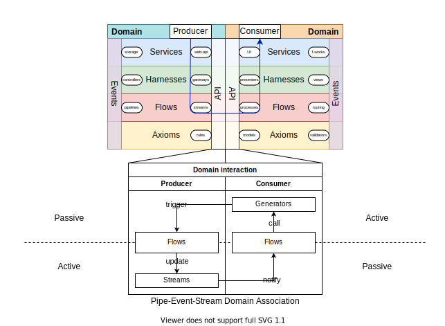

# ELDA
Event-Layer-Domain Architecture




For the step-by-step procedure that applies these rules when integrating a feature, see [FEATURE-INTEGRATION.md](./FEATURE-INTEGRATION.md).

---

## Core idea

ELDA combines **layered Clean Architecture** with **Event-Driven Design** using **Domain-Driven Design** as the organizational boundary.

Each product concern lives in its own **Domain**. Domains communicate exclusively through **event streams**. Within a domain, code is strictly stratified into four layers with one-way dependency rules.

---

## Domain structure

Every domain contains exactly four layers, stacked top-to-bottom:

| Layer | Color | Responsibility | Concrete examples |
|---|---|---|---|
| **Services** | blue | External interface to the domain (facade over external systems or the host), composed by the runtime root | UI system, API client, storage driver, platform SDK |
| **Adapters** | green | Bindings between layers or between the domain and its environment | UI bindings, request interceptors, interface adapters, presenters |
| **Use-Cases** | red | Business/application logic: processes, watchers, pipelines | Feature workflows, data transformations, event handlers |
| **Entities** | yellow | Pure, framework-free domain invariants | UX rules, data constraints, network policy |

The four layers face two audiences. A domain's **Services** are reached by the **composition root**, which instantiates and wires them; a **peer domain** reaches only the domain's **Use-Cases** and vocabulary, through the public surface, never its Services (see [constraints 14-15](#constraints-summary) for more info).\
Hence the naming: **Services** are domains *served* up for the runtime, **Use-Cases** are how domains can be re-used.

### Layer dependency rules

- **Information flows downward**: Services → Adapters → Use-Cases → Entities
- **Awareness flows upward**: Entities define interfaces for Services to implement; Entities do not import Services
- **Activity progresses top-to-bottom** through all layers for any given request
- Inner layers (Entities, Use-Cases) **must not import** outer layers (Adapters, Services)
- Dashed dependency lines = weak/optional coupling; red dashed = inadvisable (service-to-service across units), avoid

### Crossing layers

The downward edges (Services → Adapters → Use-Cases → Entities) are both control flow and source dependency: a request enters at a Service, calls down through the layers, and imports point the same way. The upward edges are control flow only, an inner layer invoking something an outer layer provides, and on those edges the source dependency is inverted.

Inversion here is purely structural - no DI container, no service locator. It means: **an inner layer declares what it needs as parameters, and the layer above supplies them.** A use-case that needs the current route takes it as an argument; the adapter that wires the router hands it down. A use-case that needs to navigate takes a `navigate` callback; the adapter supplies the concrete one. The "port" is usually just the parameter list, a structural contract, and earns a named interface only when the contract is large enough to be worth naming. The supplying happens by ordinary composition: the outer layer calls the inner one within its own scope and passes its values down. There is no separate wiring framework, because the composition is the wiring.

Corollary, the **relocation rule**: if an inner layer finds itself needing an *outer layer's module* (a use-case importing a service, an entity importing an adapter), that is misplaced logic. Split it. The pure part, a function of plain values, moves inward to where its dependencies actually are; the binding part, which reads the outer module and feeds the pure part, moves outward to the Adapters layer, whose defined job is exactly this binding. After the split nothing imports upward, because the inner part now depends only on values and on ambient mechanism.

This generalizes the rule already stated for the Entities↔Services edge ("Entities define interfaces for Services to implement; Entities do not import Services") to every layer boundary.

### Cross-cutting systems

A rendering framework, a styling system, a platform SDK, a router: these span every column and belong to no single domain. Classify each by what it delivers.

- **Mechanism** is behavior with no state of its own: reactive primitives, JSX, `requestAnimationFrame`, a scheduler. Ambient. Allowed in every layer except pure core, which is dependency-free by definition. Not wrapped, not routed through anything. A framework signal inside a use-case is local state and is fine.
- **State, and call-outs**, are values that are application state, or operations that mutate the outside world: the platform SDK's viewport and keyboard signals, storage reads and writes, request/response over the network. When these come in a shape that doesn't match the domain's, they cross the boundary by being wrapped: a Service as the facade over the raw API, an Adapter where the API is async, event-driven, or throwing (wrapped into a generator and a domain-shaped value). Inner layers receive the wrapped value as a parameter; they never import the raw API or the Service module.
- **Vocabulary** is names and shapes, no behavior or state: a styling token scale, a design system's primitives, a wire protocol's types. A shared-library contract. Domain code may reference its *stable contract* (a token name, a type) but not its *implementation* (a utility-class string is implementation). Where the reference is allowed tracks what it is: a type belongs in pure core or anywhere above; a presentation token belongs in Adapters and up, never in Entities.

The same classification settles the files a domain authors and imports, by what each *is*. A **stylesheet is code** - it composes through ports (a headless component takes its styling from the composer), encapsulates on a boundary (shadow DOM), and layers internally (BEM) - so it classifies by the layer it occupies, obeys that layer's rules, and co-located with its component belongs to that unit. The styling *system* it draws on is cross-cutting vocabulary (a token scale, above); the sheet the domain writes is its own code. A **pure-data asset** (an image, a font, a media file) carries no behavior or structure, and importing it resolves to a value, so it is vocabulary itself, classified as an Entity: importable from any layer, never a service, reached across domains only through the surface.

**Shape mismatch is what triggers the wrapping.** When an external system's API is already domain-shaped (reactive accessors, value-returning hooks, pure callbacks, idempotent on import), it is consumed directly as a use-case from another library; no wrapping is needed and no Adapter is in the chain. Domain code that orchestrates such APIs, deriving state or encoding policies over them, is itself a use-case composing use-cases. The Adapter layer is triggered specifically by shape mismatch with the domain: imperative interfaces, throwing APIs, async-callback or Promise-based control flow, mutable global state, request/response over the network. The structural Adapter pattern (an object converting interface A to interface B) appears at many layers; what places code in the ELDA Adapters layer is whether it crosses a shape boundary with the environment; converting an interface alone does not put it there.

**Cross-cutting concerns are absorbed into composition blocks exposed by services; the runtime is the only context where cross-cutting composition is unrestricted.** Every other layer has shape, direction, and generalization constraints that prevent it from cleanly composing across domains. A cross-cutting concern (a navigation policy, a theme application, a localization rendering, a loading shell) cannot escape its owning domain as a free-floating hook, component, or helper that consumers call wherever they need it; doing so re-introduces cross-cutting at a layer that does not permit it. The way a cross-cutting domain expresses its concerns is by exposing **composition blocks** (services) that absorb the concern internally. Other domains contribute data and behavior contracts; the cross-cutting domain provides the blocks that render those contracts with the concern applied. The runtime composes feature data into cross-cutting blocks. This is the only place in the architecture where cross-domain composition has free reign, and it is the place ELDA reserves for it.

The boundary between a directly-consumed cross-cutting use-case and a concern that must become a block is fixed by a single test, because the two rules above (consume domain-shaped APIs directly; do not let cross-cutting escape as a hook) otherwise give opposite verdicts on the same helper. A cross-cutting hook that reads only ambient mechanism or another domain's already-published reactive state and returns a pure value, owning no state and idempotent on import, is consumed directly as a use-case. A concern that owns state, encodes a policy, or authors markup that more than one consumer would otherwise re-author must be a composition block. The discriminating question is not whether the helper is reusable but whether consuming it as a bare hook forces each consumer to re-author the concern: a pure predicate does not, so it stays a hook; a navigation push-versus-replace policy, a theme application, a loading shell do, so they are blocks.

The same shape recurs between domains. A domain's only sanctioned cross-domain channels are its two surfaces, API and Events, via Streams and Generators. A domain whose Service can be imported by another domain's code has skipped this: it failed to put its producers behind a surface. The fix belongs on the producer side (expose the value as a Stream, or the operation as a Generator), where the missing surface actually is.

### Domain surface

Each domain exposes two perpendicular interfaces:

- **API** (left side): callable input surface; how other code invokes this domain
- **Events** (right side): observable output surface; what this domain emits when state changes

Peer domains interact with this domain exclusively through these two surfaces, realized as one named **consumable surface** that carries its use-cases and vocabulary. Services are not on it; they are published on a separate **runtime-composition surface** that only the composition root reaches, to instantiate and wire them. The division is by audience: a peer domain consumes use-cases and vocabulary, the composition root composes services.

#### The API-Event surface

Each domain's two interfaces, API and Events, are realized as a single public **consumable surface**: a named target consumers reference, in whatever form the host language and module system provide. The concrete mechanism (a barrel module, a `pub` export, a public package interface, several split entry targets where build output requires them) is a language-and-tooling concern; the discipline that follows is architectural:

- Consumers reference the public surface by name. They do not reach past it into the domain's internal modules, files, or directory tree.
- The public surface is the contract. Re-organizing internals leaves consumers untouched.
- The internal layer structure (Services / Adapters / Use-Cases / Entities) is private to the domain. Whether each layer is a subdirectory, a file, or a class is implementation.

This sharpens the Composition root rule: a cross-domain reference is the domain identifier, and any reference that reaches past the public surface name is a deep reach and a smell.

Internal files use concrete names that describe their contents. ELDA's architectural vocabulary (Stream, Generator, Service, Vocabulary) belongs in this document, while filenames stay in the engineer-canonical register. The public surface mediates between the two registers, so consumers see named exports and can ignore the internal layout that produced them.

### Composition root

A Service is the input surface a layer above the four-layer stack reaches into. That layer is the **runtime composition root**: the entry point the host runtime instantiates directly. In a router-driven UI app the root is the route tree (`__root.tsx`, layout routes, leaf routes); in a request-driven server it is the request handlers; in a CLI it is the entry command. Everything else - other services, adapters, use-cases - is *composed by* the root; none invoke each other directly.

Services are **composed** by the root. The composition root wires services together: it instantiates them, supplies their ports (slot content, callback parameters, configured policies), and decides which combination this run uses. A service does not import and mount another service. Doing so inverts the composition direction (the inner service dictates what its parent looks like) and bypasses the root's authority over what gets wired. If a service needs another service's content inside itself, it accepts a named slot port and lets the composition root pass that content in.

The rule applies to **service ↔ service** specifically. A service consuming a use-case is fine: use-cases are behavioral hooks the service implements its logic with. Tooling outside the production surface (dev panels, instrumentation, scaffolds) lives outside this rule by design: its job is to inspect or perturb the running app, which presupposes a position the production composition wouldn't give it.

This rule and the cross-domain rule act on different axes and do not collide. **Cross-domain communication** still flows only through Streams and Generators (the API/Events surfaces above); cross-domain *Service imports between domain internals* are still the failure case the "Cross-cutting systems" section names. A composition root, by contrast, sits outside any domain's internals and is allowed to reach into multiple domains - that is precisely its job. A route file that composes this domain's services and that domain's use-cases is doing the composition root's job, no carve-out required.

The composition root's cross-domain license is **breadth across domains, with its depth held at each surface**: it may reach into many domains, but into each only through that domain's published surface - the cross-domain barrel, and the runtime-composition (services) surface for the pieces the runtime wires. It does not reach into a domain's adapters or entities, and the use-case hooks it wires are exposed on a surface rather than deep-imported by layer path. Reaching past the surface into internal layers is ladder-creep: the root accretes dependence on internals, and the surface's authority erodes from the one consumer hardest to constrain. The breadth the root is granted is exactly why its depth must stay at the surface.

Practical signal: in a source dependency graph, every service file should appear as a *target* of imports only from composition-root files, from sibling layers within its own domain (its adapters, use-cases, entities), and from the other files of its own unit. It should not appear as a target of imports from any other service unit, in or out of its domain.

The unit the rule acts on is the **directory**. A service's implementation is the files co-located in its directory - a flat `Thing.ext` cluster sharing a name, or a self-segregated `Thing/` folder of differently-named parts (an entry, helpers, a stylesheet) - and those files are one service composing itself; co-location of related code is ELDA's organizing structure, so an intra-unit import carries no restriction. A component reaching for its own co-located stylesheet or helper is one unit assembling itself across files and languages, and the service ↔ service rule does not reach inside it. The rule operates between units: a *different* service unit, a different directory, is what may not be imported and mounted. Co-location joins files into one service, and a separate directory splits them; to enforce a boundary between two services that share a directory, give each its own.

### The runtime integration surface (imperative shell)

The runtime composition root has an outer face the four-layer stack does not: the **runtime integration surface**, the imperative shell where the architecture meets the host runtime's own primitives. The schematics show it; earlier editions of this prose omitted it. Its job is to reconcile the high-level concerns the domains expose into an actionable sequence fit for the runtime context, expressed in that context's primitives: a framework's mount lifecycle and signals, a platform SDK's boot and lifecycle calls, the browser's `navigator` and DOM, service-worker registration. It is the one place where the otherwise-banned `async`/`await` and `try`/`catch` are legitimate, because boot sequencing genuinely needs them and they never enter a domain's call graph. Constraint 7 governs the domain layers; the imperative shell sits above them and is the boundary at which the platform's async and throwing primitives are sequenced before any domain runs.

The surface has two allowances and one prohibition. It may **sequence**: instantiate domain services, supply their ports, subscribe and route their streams, and order the runtime's own primitives into a context-fit boot. It may **not chew**: it holds no domain decision and no owned-vocabulary literal. The discriminator is whether a line *names and orders* owned surfaces and runtime primitives, or *re-implements* a semantic a domain owns. `await initMiniApp(); initTheme(app)` names and orders (allowed). `if (app.env === 'max') document.body.setAttribute('data-platform', 'max')` re-implements host-identity-to-styling, a vocabulary owned by the styling domain and consumed by its CSS, by re-spelling a literal the owner already holds (prohibited; it belongs in the owner, which exposes a binding surface the shell calls).

The prohibition exists because the integration surface is the one zone exempt from the layer rules, and an exempt zone acquires catch-all gravity, the same pull that turns an Adapters layer or a `shared/` column into a dumping ground. The owner breaks its own semantics into edible parts inside its domain, where the producer-to-meaning binding still holds, and exposes those parts; the shell feeds them to the platform in sequence. The shell sequences the pre-chewed parts its owners produce.

### Vocabulary

Vocabulary in the cross-cutting classification (design tokens, type aliases, wire schemas) is *owned by one domain*: the one that emits it. Other domains do not re-declare, re-bundle, or hold their own manifest of the same vocabulary; consumption flows through the owner's public surface.

Where the vocabulary is reactive (a current theme identifier, a current locale), the public surface carries it through whatever the host runtime provides for runtime-supplied values: a context handle, a request scope, a dependency-injected binding. Consumers receive values through that channel.

Where the vocabulary's static representation must exist before runtime composition (compile-time style emission, schemas consumed by code generators), the static module lives with the owner. Consumers reference the owner's wire-level identifiers, names that are part of the contract, through whatever channel does not require importing the owner's module: a string reference, a name lookup, a code-generation pipeline output.

The principle does not mandate a specific runtime channel. It mandates that consumers do not re-declare vocabulary they don't own, and that the owner remains the single point of emission.

The same ownership governs vocabulary that lives in a **shared runtime namespace** rather than a module: a DOM attribute and its CSS selector, a CSS custom property, a storage key, a URL parameter, a postMessage type, a runtime global. These are string-keyed identifiers shared by convention across packages and across representation boundaries (a JavaScript string on one side, a CSS selector on the other), with no import edge linking writer to reader. This is the one channel where the typed source-dependency this architecture relies on cannot exist, because the host platform offers no slot to carry the semantic alongside the primitive. They are vocabulary nonetheless, owned by one domain; consumers reference the owner's declaration (a typed constant, an exposed binding surface, a code-generation output that emits both representations from one source), never a re-spelled literal. A literal re-declaration is invisible to every search that follows imports and reads as dead code to anyone without the cross-package context, so the leak is both silent and dangerous to remove. Introducing a new such identifier is an act of creating vocabulary: it gets an owner first, then a binding surface, before any site writes it. Because the writer/reader seam crosses representations no single type system spans, the binding cannot be machine-checked at the primitive; collapse it to one owner-internal point that code-generation spans, and enforce one level up (no owned-vocabulary literal outside its owner; the owner emits both ends from one declaration).

Consuming an owner's *identity* vocabulary takes three forms of decreasing safety, and the type system hides the difference between them. **Referencing** it - comparing a value against the owner's literal where the comparison is checked against the owner's type, or naming the owner's exported identifier - is sound: a rename in the owner breaks the reference at compile time, the binding working as intended. **Deriving behavior keyed on** an identity value, such as branching on `host === 'telegram'` to choose a layout rule, is a smell even when the literal is type-bound, because it re-owns the owner's *behavioral* semantics: the type checks the name but not the policy, so a new identity with the same behavior is silently mishandled, and "this identity behaves this way" now lives in two places. **Re-declaring** the literal with no type binding, a bare string written into a shared runtime namespace, is the worst and is forbidden outright (above): invisible to import-following search, broken by a rename or removal with no signal. The rule: reference identity vocabulary by type freely; do not derive behavior keyed on identity values. Have the owner expose the *capability* its identities imply and branch on that - the owner knows which of its identities carry which behavior, and a consumer that re-derives it has taken on knowledge the owner should have published.

---

## Domain ontology

Domain boundaries are drawn deliberately. They are decisions about how to partition the problem space, and those decisions evolve as understanding matures. There is no single correct partition.

The useful mental model is a **Venn diagram**. Each domain is a set. Code exists somewhere on the diagram - inside one circle, at the edge of a circle, or at the intersection of two or more circles. The position of a piece of code on the diagram is determined by its dependencies: what it imports tells you which circles it gravitates toward.

This reframes the classification question. "Which domain does this belong to?" becomes "where on the diagram does this sit?" The second question is always answerable from the code itself. The first requires judging essence, which is often impossible early in a project.

As understanding matures, boundaries sharpen. Code migrates toward the circle it most belongs to, and the diagram changes shape. This is expected and healthy: the original structure was right for what was known when it was drawn.

---

## Inter-domain communication

Domains interact via the **Pipe-Event-Stream** pattern. Direct cross-domain calls are inadvisable.

```
Producer Domain                     Consumer Domain
─────────────────                   ─────────────────
Use-Cases
  │  update
  ▼
Streams ──────── notify ──────────▶ Use-Cases
                                      │  call
                                      ▼
Use-Cases ◀────── trigger ────────── Generators
```

- **Producer** domain's Use-Cases update a **Stream** (an observable/subject)
- The stream **notifies** the Consumer domain's Use-Cases
- Consumer Use-Cases **call** their own **Generators** (reactive sources)
- Generators **trigger** Producer Use-Cases, completing the cycle

**Streams and Generators are runtime-agnostic abstractions.** ELDA defines them by direction: a Stream pushes values to subscribers; a Generator delivers values when pulled. The architecture does not mandate a concrete mechanism. A given runtime picks primitives that fit the shape, and the same architecture can run across different runtimes that each implement these in their own idiom. The architectural rule is that domains communicate through these channels exclusively; the primitive choice is a runtime concern.

**The data shape passing through a channel is orthogonal to its direction.** A Stream or Generator may carry event-shaped values (discrete emissions, no notion of current value, missed emissions are lost without explicit replay) or state-shaped values (always a current value, late subscribers see it, intermediate updates are aggregated). Both shapes fit both ELDA roles. Channel shape is an implementation decision governed by what consumers need from the channel (replay semantics, behavior for late subscribers, memory of past emissions), independent of the ELDA category. Two channels carrying different shapes can both be Streams (or both Generators) at the architectural level; the category names the direction, and the storage model is a separate, orthogonal choice.

A domain is **Active** when it initiates the cycle (Producer role) and **Passive** when it reacts (Consumer role). The same domain can play both roles in different interactions.

### Domain tiers

The inter-domain stream graph must be a **DAG** - no domain may be both upstream and downstream in the same causal chain. To make this structurally explicit, domains are arranged into tiers. Stream subscriptions only flow downward across tiers:

```
Feature domains          top      - product-specific; consume from all tiers below
Orphan intersections     second   - named by relationship; consumed by feature domains
Transport / Storage      terminal - consumed by all; consume nothing above themselves
Pure core                bottom   - dependency-free; consumed by everything
```

Feature domains at the same tier must also form a DAG among themselves - no two peer feature domains may subscribe to each other's streams in a cycle.

When coordination between same-tier domains is unavoidable, the prescribed solution is a **Mediator** use-case that explicitly owns the coordination. This makes the cross-domain dependency visible and locates the termination condition in one place.

### Cycle enforcement

Tier rules are written constraints. Runtime enforcement is provided by the **event-exchange interface** - the single infrastructure layer all stream emissions and generator triggers pass through.

Each stream emission carries a **causal set**: the set of stream IDs already in its propagation chain. Before the event-exchange interface delivers a notification to a generator, it checks whether the target stream is already in the causal set. If it is, the trigger is dropped. If it is not, the target stream ID is added to the causal set and propagation continues.

This check is implemented once in the event-exchange interface and applies automatically to every domain in the system. No per-domain cycle-detection code is needed.

---

## Full application structure

A complete ELDA application is built from several columns of domains/subdomains, each with the same four-layer stack:

### Feature domain
The product-specific vertical slice. One per product feature (e.g. `home`, `profile`, `faq`).

| Layer | Feature-domain slot |
|---|---|
| Services | UI (system): viewport, platform, SDK |
| Adapters | UI (bindings): component-level wiring |
| Use-Cases | B-Logic (watchers): reactive logic, event subscriptions |
| Entities | Pure UX rule invariants |

### Orphan intersections

Code at the intersection of two domains forms an **orphan** - a module named by its relationship between its parent domains, recording which domains it sits between before it has a concept of its own.

`home+profile` is an orphan at the intersection of the `home` and `profile` domains. It has no owner. Both parent domains consume from it. It does not consume from either parent.

Naming by relationship removes the pressure to understand something before classifying it. When the concept behind an intersection becomes clear - when you can say what the orphan *is* rather than what it *intersects* - it earns a name and becomes a full domain. Until that point it remains honest about its nature.

Orphan rules:
- Named by the domains it intersects (`a+b`), before it earns a concept of its own
- Consumed by its parent domains; does not consume from them
- Sits below feature domains in the tier hierarchy; may consume from terminal subdomains and pure core
- Carries only the ELDA layers it actually needs; a minimal orphan may be just an Entities layer and accumulates further layers as it grows

Promotion signals:
- You can describe what the orphan *is*, beyond which domains it intersects
- It starts consuming from a domain outside its declared intersection
- It accumulates all four layers with substantial content in each

A three-way intersection (`a+b+c`) almost always signals a hidden domain that has not yet been named.

### Pure core

Pure code - code with no imports and no side effects - has no domain gravity. It sits at the center of the Venn diagram, belonging equally to all circles. It lives in a flat **core** layer at the bottom of the tier hierarchy, consumed by everything and depending on nothing.

Core contains only dependency-free code: type definitions, branded types, pure transformation functions, base interfaces with no domain-specific semantics. Any code with an import belongs somewhere in the tiers above.

### Transport subdomain
Owns all transport concerns. Feature domains call into it; it never imports feature domains.

| Layer | Transport slot |
|---|---|
| Services | API client + proto definitions |
| Adapters | Interceptors |
| Use-Cases | B-Logic (validators) |
| Entities | Network rules (retry, timeout, auth policy) |

### Storage subdomain
Owns all persistence and caching concerns.

| Layer | Storage slot |
|---|---|
| Services | Storage (persist + cache) |
| Adapters | Interface (bindings) |
| Use-Cases | B-Logic (CRUDs) |
| Entities | Data storage rules |

### Subdomains
Three cross-cutting concerns that span all columns:

- **UI subdomain**: everything visual, component framework, rendering
- **Network subdomain**: transport, protocol, request lifecycle
- **Data subdomain**: persistence, caching, serialization

---

## Concurrency model

`async`/`await` and raw Promise chains are banned from all userland code. The async/await model splits a codebase into two mutually incompatible function kinds: callers and callees must agree on the same kind to interoperate, and this agreement propagates transitively through the entire call graph. The result is two separate, non-composable camps.

Instead, every asynchronous operation is treated as a **single-value stream** and wrapped in a generator before it enters any domain layer. This wrapping is the responsibility of the **Adapters layer**, which is already the designated boundary for external integrations. Use-Cases and Entities receive only generator protocol and never a raw Promise.

Practical rule: if a platform API or third-party library returns a Promise, wrap it in a generator at the Adapters layer and advance it with a `yield` inside the domain.

This keeps all domain code one consistent kind. Generators compose freely with other generators, call stacks stay coherent end-to-end, and the subscription graph remains statically traceable by reference without runtime inspection.

---

## Outcome model

ELDA has no error model because it does not classify exceptions as a distinct category. All code paths - successful, failed, partial, or any other - are branches in logic. A network timeout, a validation failure, and a successful response are all values emitted by the same stream; the consumer decides what each branch means.

Exception-throwing code is treated as impure for the same reason as async code: it breaks the uniform value-producing contract of generators. Any library or platform API that throws must be wrapped at the Adapters layer into a generator that yields a typed branch value instead.

Rules:
- No `try`/`catch` inside Use-Cases or Entities
- No separate error channels alongside normal value channels
- All outcomes flow through the same Streams/Generators infrastructure as typed values
- Branch handling is enforced by the type system on the emitted value shape

The "errors as values" pattern (Rust's `Result`, Haskell's `Either`) approximates this but still treats one branch as semantically wrong. ELDA takes no position on which branches are positive or negative - that is domain logic, expressed as branch values in the stream.

This model depends on the type system to be fully enforceable. Exhaustive union checking (TypeScript discriminated unions, Rust `match`) ensures all branches are handled at compile time. Without that guarantee, the enforcement burden shifts to code review and convention.

---

## State model

State is always local to the domain, layer, or entity where it originates. There is no global state construct. Domains do not share mutable references.

State that must cross a domain boundary is published, never shared by reference. The producing domain emits values through a Stream; consuming domains subscribe to that stream. The consumer holds a subscription reference to the stream, distinct from the producer's internal state.

This distinction prevents three categories of problems that global state introduces:

- **Write contention**: no two domains compete for write access to the same mutable location.
- **Implicit reflow**: no consumer is silently re-evaluated when a distant producer mutates.
- **Stale snapshots**: the stream delivers the current value at subscription time and every subsequent update; there is no cached copy to go out of date.

Framework-level reactive primitives (RxJS BehaviorSubjects, SolidJS signals) are permitted as implementation tools. They belong at the layer where the state originates. A signal inside a Use-Case is local state; if its value needs to cross a domain boundary, it is wrapped in a Stream and exposed through the domain's Events surface.

---

## Advised design patterns

| Layer | Pattern | Purpose |
|---|---|---|
| Services | **Facade** | Simplified interface over an external system (platform SDK, storage driver, API client) |
| Services | **Factory** | Produces service instances; accommodates platform-specific variants |
| Adapters | **Adapter** | Converts an external interface to the domain-expected shape |
| Adapters | **Decorator** | Adds cross-cutting behavior (retry, auth, logging) without changing the adapted interface |
| Adapters | **Proxy** | Controls or defers access to an expensive external resource |
| Use-Cases | **Command** | Encapsulates a use-case invocation as an executable object; enables queuing and undo |
| Use-Cases | **Mediator** | Coordinates same-tier inter-domain interaction from a single explicit termination point |
| Use-Cases | **Chain of Responsibility** | Passes a request along a handler pipeline; each handler decides to process or forward |
| Entities | **Strategy** | An interchangeable domain rule expressed as a swappable algorithm |
| Entities | **Composite** | Composes simple rules into arbitrarily deep rule trees |
| Entities | **Specification** | A named, composable domain predicate; combinable with AND / OR / NOT |
| Entities | **Value Object** | An immutable object defined by its value, not identity; structurally enforces a domain invariant |

---

## Brittleness as a property

ELDA optimizes for composability, refactor-friendliness, and locality of change at the cost of robustness against discipline lapses. The structural payoff (general logic at the composition root, system concerns at adapters, business logic at use-cases and entities, no leakage sideways) is held in place by every boundary being respected at every cross-domain touch. A single cross-domain deep import, a single cross-cutting hook exposed past its owning domain, a single service composing another service, and the local-scope-of-change property degrades from that point outward.

This trade-off is deliberate. Architectures that prioritize malleability over rigor (Flux / Redux, Entity-Component-System, layered MVC) accept locality compromises so that an individual contributor's slip does not cascade through the structure. ELDA accepts the opposite: tighter structural payoff when the constraints hold, sharper degradation when they break. The grep tests written into the constraints (no deep imports past a public surface, no cross-cutting hooks at consumer sites, no service-to-service composition) function as scout signals, not enforcement; the architecture relies on reviewers and tooling to hold the line at the boundaries.

Choose accordingly. ELDA fits codebases where the cost of structural drift is high (multi-year products, multi-team handoffs, systems that must remain navigable as they grow), where reviewers and tooling can be relied on to catch the slips at PR time, and where the team values the property of "a change has the scope its diff says it has" enough to keep the discipline. It is the wrong fit for prototypes that prioritize speed of one-off experiments, codebases without an enforcement culture at the boundaries, or teams that prefer architectures absorbing discipline lapses gracefully over those rewarding rigor.

This trade-off is only sound when the rules that *can* be checked mechanically are checked mechanically, so that the human attention the architecture depends on is spent where no machine can reach. Enforcement therefore splits into three tiers. **Machine-enforced invariants** are the rules that are both structurally decidable and unambiguous when violated - import boundaries, no inner layer importing an outer one, no `async`/`await` or `try`/`catch` in the inner layers, no service-to-service import, no owned-vocabulary literal outside its owner - and these are CI gates, never a reviewer's burden. **Review-enforced judgments** are the calls a tool cannot settle, whether or not it can surface them - domain placement and promotion, port-versus-block shape, branch exhaustiveness, the introduction of a new shared-namespace identifier, and an export with no current consumer. That last one a tool can flag but cannot judge: the surface invariant is that consumers reference nothing past the surface (`consumers ⊆ surface`), and never that the surface carry nothing unconsumed (`surface ⊆ consumers`). An unconsumed export is either dead surface to trim or a capability deliberately exposed ahead of demand - and keeping the surface free to lead its consumers is the Open-Closed latitude that lets a new consumer arrive without forcing a producer edit. A tool surfaces the candidate; a human decides which it is. **Scheduled maintenance** are the obligations the architecture has but does not trigger on its own - re-evaluating the domain ontology as it matures, keeping the vocabulary registry current, and confirming that a license such as "domains may react freely" has not outrun the enforcement (the causal-set cycle check) that makes it safe.

The failures this architecture actually suffers are the failures humans reliably make - omission, deferral, label-lag, avoiding boilerplate - not the conspicuous violation a reviewer catches in a small diff. Mechanizing the first class is what keeps catching the second affordable. Lint rules over the grep tests, type-system constraints on cross-domain imports, and structural validation in CI are not future hardening to be deferred; they are the precondition under which choosing brittleness is rational. A project that adopts ELDA's locality payoff without standing up Tier 1 has accepted the brittleness without buying the thing that makes it pay.

---

## Constraints summary

1. Inner layers never import outer layers within a domain.
2. Domains communicate exclusively through Streams/Generators.
3. Each domain exposes exactly one API surface and one Events surface.
4. Orphan intersections are named by their parent domains (`a+b`); they are consumed by their parents and do not consume from them.
5. Transport and Storage subdomains are consumed by feature domains and orphans; they do not consume upward.
6. Streams and Generators are direct typed references; string-keyed dispatch is not permitted.
7. `async`/`await` and Promise chains are not permitted in userland code; async operations are wrapped as single-value streams at the Adapters layer.
8. The inter-domain stream subscription graph must be a DAG; stream subscriptions flow downward across tiers (Feature → Orphans → Terminal → Core).
9. The event-exchange interface tracks a causal set per emission and drops any trigger that would re-enter a stream already in that set.
10. Pure core contains only dependency-free code; any code with an import belongs in a domain, orphan, or subdomain above it.
11. Upward layer edges are dependency-inverted: an inner layer declares its needs as parameters; the adjacent outer layer supplies them by composition. No DI container or service locator.
12. An inner layer needing an outer layer's module is misplaced logic: split it, pure part inward, binding part to Adapters.
13. Cross-cutting systems are mechanism (ambient; all layers but pure core), state-and-call-outs (wrapped at Services/Adapters, passed inward as values), or vocabulary (shared-library contract referenced by name; presentation vocabulary never in Entities).
14. Services are composed by the runtime composition root, not invoked by other services. A service ↔ service direct import across units (constraint 25) inverts composition direction and is a smell; the consuming service should accept a named slot port and let the composition root supply the contents. Use-cases consumed by services are exempt (they are behavioral hooks, not composition surfaces). Production-path code only; dev tooling lives outside the rule.
15. A domain publishes its surface to two audiences. Its consumable surface - a single named target, the barrel - carries the use-cases and vocabulary any peer domain references, and does not expose services. Its runtime-composition surface carries the services the composition root instantiates and wires, and only the root references it. Consumers reference a surface by its named target and never reach past it into the domain's internal structure.
16. Vocabulary (design tokens, type aliases, wire schemas, ambient declarations) is owned by one domain. Other domains do not re-declare, re-bundle, or hold their own manifest of the same vocabulary; consumption flows through the owner's consumable surface (constraint 15). Ambient declarations (`declare global`, ambient `declare module`, `.d.ts` files) are co-located in the owning domain.
17. The Adapter layer is triggered by shape mismatch between an external system and the domain (imperative interfaces, throwing APIs, async-callback or Promise-based control flow, mutable global state, request/response over the network). Externality without shape mismatch does not trigger it; external APIs that are already domain-shaped (use-case-shaped) are consumed directly and orchestrated as use-cases composing other use-cases.
18. Cross-cutting concerns are absorbed into composition blocks exposed by services. Cross-cutting logic does not escape its owning domain as a free-floating hook, component, or helper; consumers receive blocks that have the concern already applied. The runtime composition root is the only context that may compose blocks from multiple domains freely; every other layer is constrained against cross-domain composition.
19. The runtime composition root has an imperative-shell face, the runtime integration surface, where `async`/`await` and `try`/`catch` are permitted for boot sequencing. It may sequence owned surfaces, ports, and runtime primitives; it may not hold a domain decision or an owned-vocabulary literal. It sequences the owner's pre-chewed parts; it does not re-implement an owned semantic.
20. String-keyed identifiers in a shared runtime namespace (DOM attributes and their selectors, CSS custom properties, storage keys, URL parameters, postMessage types, runtime globals) are vocabulary under constraint 16, owned by one domain. Consumers reference the owner's declaration - a typed constant, an exposed binding surface, or a code-generation output emitting both representations from one source - never a re-spelled literal. Introducing a new such identifier creates vocabulary and gets an owner before first use.
21. The boundary between a directly-consumed cross-cutting use-case (constraint 17) and a composition block (constraint 18) is fixed by one test: a hook that reads only ambient mechanism or published state and returns a pure value, owning no state, is consumed directly; a concern that owns state, encodes a policy, or authors markup a consumer would otherwise re-author must be a block.
22. The brittleness trade-off is conditioned on enforcement tiers: rules that are decidable and unambiguous when violated are machine-enforced CI gates; decidable-but-not-self-evident signals (an unconsumed export - dead surface, or a capability exposed ahead of demand) are surfaced by a tool yet judged by review, alongside the calls no tool can make; and the architecture's non-self-triggering obligations (ontology re-evaluation, vocabulary-registry upkeep, keeping reactive-freedom licenses within their enforced cycle-safety) are scheduled maintenance. The public-surface invariant is `consumers ⊆ surface`, never `surface ⊆ consumers` - a domain may expose more than its current consumers require.
23. Consuming an owner's identity vocabulary has three forms of decreasing safety: referencing it by type (sound), deriving behavior keyed on an identity value (re-owns the owner's behavioral semantics - type-safe against renames but not against new identities, a smell), and re-declaring a literal with no type binding (invisible and rename-fragile, forbidden by constraint 20). Reference identity vocabulary by type; do not branch behavior on identity values - have the owner publish the capability its identities imply and branch on that.
24. The composition root consumes each domain only through its published surface (the cross-domain barrel and the runtime-composition surface); its cross-domain license is breadth across domains, with depth held at each surface. It does not import a domain's adapters or entities, and use-case hooks it wires are exposed on a surface rather than deep-imported by layer path.
25. The service ↔ service rule (constraint 14) acts on units, where a unit is a directory: the files co-located in one directory - a flat name-stem cluster or a self-segregated folder of parts - are one service that composes itself without restriction. A different service unit, a different directory, may not be imported and mounted. To separate two services that share a directory, give each its own.
26. What a file is fixes its layer. A stylesheet is code: it classifies by the layer it occupies and obeys that layer's rules, and co-located with its component it belongs to that unit. A pure-data asset (image, font, media) is vocabulary, classified as an Entity: importable from any layer, never a service, surface-gated across domains.
